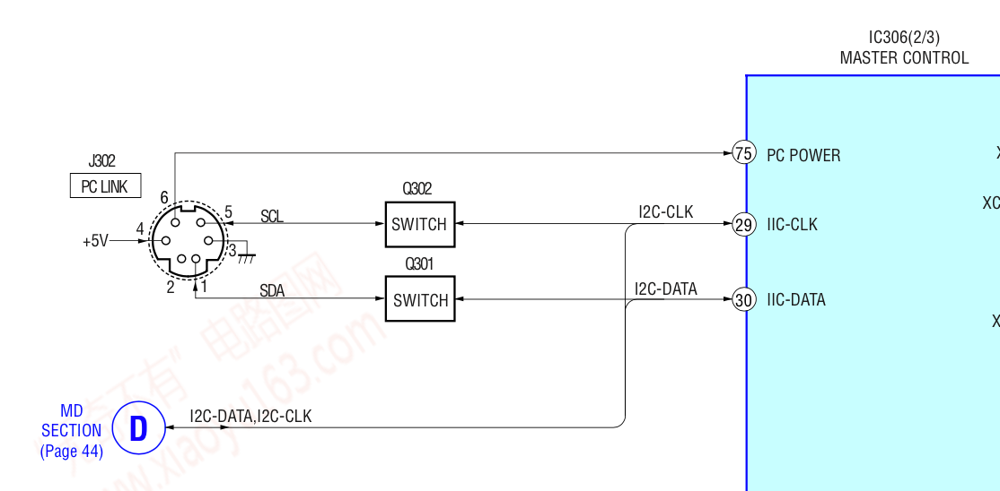

# pclink-i2c

This project contains information on the PC-Link hardware interface for some early 2000 Sony HiFi decks, such as the CMT-DC500MD (also known as HCD-J300), DHC-MD595, and more. These decks can communicate with a PC using a PCLK-MN10 adaptor and M-Crew software. There exists open-source software for controlling these decks using the official PCLK-MN10 adaptor. This project aims to document how to achieve the same, but **without** adaptor, using off the shelf electronics.

## Demo

See https://www.reddit.com/r/minidisc/comments/s78dyj/didnt_have_a_pclink_for_my_fancy_new_sony_hcdj300/

## Hardware
A 6-pin mini-din connector (such as is used by PS2 keyboard/mice) is used for the interface. Communication is essentially done using I2C, with some minor MOSFETs and I2C buffers to create a more stable external interface. The I2C bus for the interface is used-by/connected-to at least two peripherals inside of the deck (in the case of the HCD-J300), the main digital board handling the logical glue between the components of the deck, and the main controller board, handling input (buttons, remote, display).

The service documentation for the HCD-J300 has this helpful diagram:

As you can see, aside from the I2C bus, there is one additional interface available named "PC POWER". Presumably, this is used to turn on the HiFi deck when it's in standby mode (as the internal peripherals listening on the I2C bus are disabled in this state), but this **needs to be tested** in order to confirm.

## Protocol, I2C bus

Scanning reveals that there are 3 peripherals available on the I2C bus, at 0x00, 0x09, and 0x10. Sniffing on the bus reveals that the physical control panel circuitry (button interface) sends commands to 0x00 (although we aren't 100% sure yet if this address isn't used by multiple peripherals).

### Sending commands

Initial testing reveals that the commands are essentially the same as what the M-Crew software sends to the official adaptor (without some packaging). Commands as previously documented by other reverse engineering projects for this adaptor (such as https://github.com/4gra/pclk-mn10/blob/master/commands.json) can easily be transmitted using I2C transactions.

To send a command, initiate a transaction for address 0x00, and start with **0x20**, following with the bytes for the commands.

E.g., in the case of the Arduino framework, to open the CD drive:

>  Wire.beginTransmission(0x0);
>  Wire.write("\x20\x90\x54\x00\x01");
>  Wire.endTransmission();

### Reading data

I2C logs reveal that responses seem the be sent to address 0x00 as well, but the byte streams are prepended with **0x12** instead of with **0x20** (as is with commands). Possibly this means that both peripherals in the deck use the 0x00 address, but 0x12 commands are used to update the controller board (e.g. the display), and 0x20 to send commands to the digital glue logic (e.g. eject MD). **More research is needed!**

As of now, it is not yet clear how to read command updates without sniffing raw I2C. You probably could put the Arduino/ESP address to 0x00 as well, but that seems odd. Possibly there is some sort of subscription command.

## Resources

https://github.com/4gra/pclk-mn10/
https://github.com/Ircama/Sony_SLink